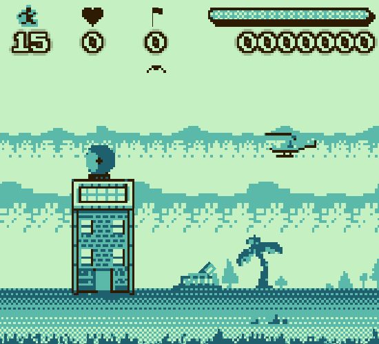

# Hostage Rescue

Play it: https://scottpetrovic.itch.io/hostage-rescue

Godot 4.4 project that is mostly a clone of the gameboy game "Choplifter". It was made to help me understand how to architect a small game with multiple levels There are only 3 levels built out. Levels 6-9 exist, but the levels are very minimal where you save a hostage then return them to base.

The repository has a Krita KRA file that I used to build out some of the art assets. 

